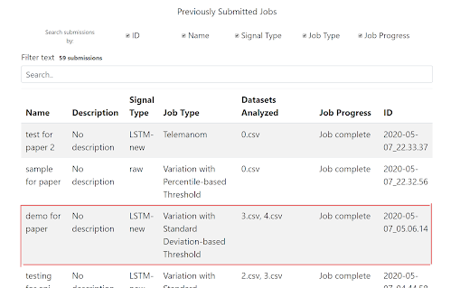
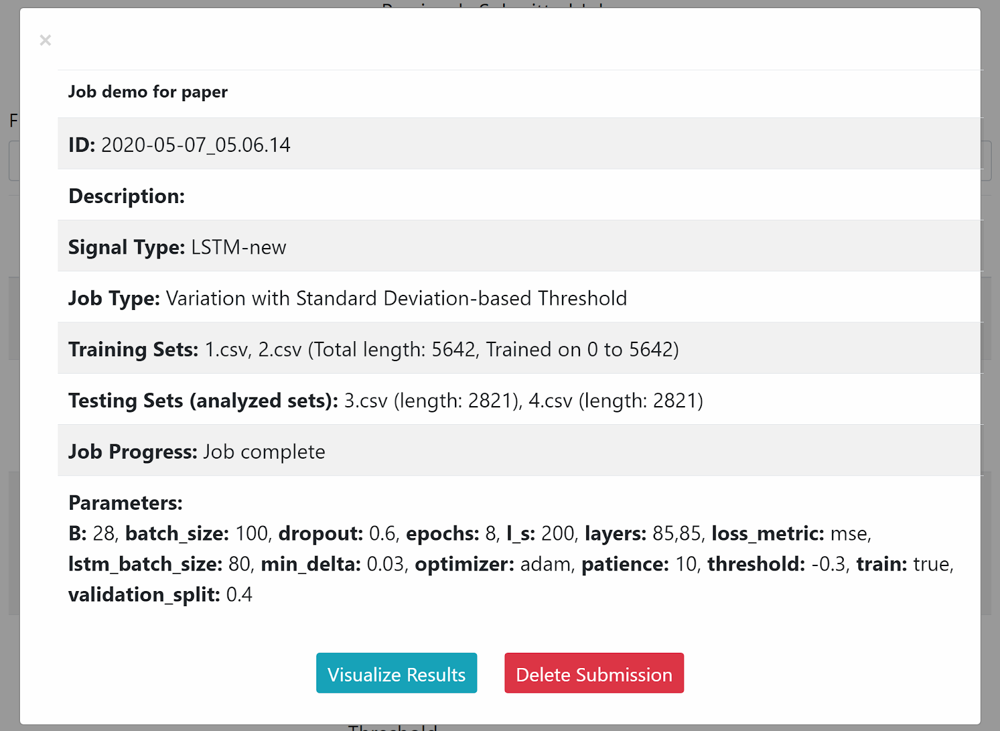

# AnomalyDetector

A website and API tool for exploring anomalies in fNIRS data using both machine learning and statistical methods.

This README is an extensive guide on the features, code structure, and usage of the AnomalyDetector tool. Some sections
are meant for first time users or people that do not have coding experience (Sections 1, 2, 5, 7), while others are meant for
experienced developers or the curious who would like to understand how everything works under the hood. 

## Table of contents
1. [ Features of the tool. ](#features)
2. [ Why we created this tool. ](#backgound)
3. [ Code Structure. ](#codeStructure)
4. [ Structure of Postgres, MongoDb, and AWS Collections](#dbStructures)
5. [ Installing and running code from your device ](#installation)
6. [ API functionality ](#api)
7. [ Navigating the Website as a User ](#ui)
8. [ Known Bugs ](#bugs)
9. [ Future Development ](#future)

## 1. Features of this tool

The tool consists of a website and API, both of which have the same basic functionality: 
- Giving the user the option to smooth the submitted signal arrays using newly or previously trained LSTM-RNNs models (Long-Short Term Recurrent Neural Networks).
- Detecting anomalies of submitted signals (or smoothed signals) using one of the following methods:
    - Telemanom (Hundman et al, 2018)
    - Variation with Standard Deviation-based Threshold
    - Variation with Percentile-based Threshold
    - Variation of Variation with Standard Deviation-based Threshold
- Storing and visualizing the results of the anomaly detection

You can read more about LSTMs and the anomaly detection methods on my paper linked [here](https://drive.google.com/file/d/15DNh4O4GolQIT6FgowC0aPXs22uu56Cw/view?usp=sharing).

## 2. Why we created this tool

Functional near-infrared spectroscopy, or fNIRS, is an emerging hemodynamic neuroimaging technology that can be used to 
map brain activity (Ferrari & Quaresima, 2012). The technology gathers data about the amount
of oxygen flowing in parts of a patient’s brain, which helps scientists understand the level of activity in that part of 
the brain. fNIRS mapping is
becoming increasingly popular because of its ease of use and practicality with
more sensitive subjects such as kids and the elderly (Teresa Wilcox, 2015).
Among other applications, analyzing fNIRS data can potentially pave the
way for more streamlined Human-Computer Interaction and more intuitive
Brain-Computer Interfaces (BCI).

With any collection of data, there may be one or multiple data points that
deviate significantly from the rest of the data, called anomalies. Anomalies can
provide a lot of critical information about the data: technical incidents such
as a faulty sensor, new trends, etc. Knowing where the anomalous data points are can help scientists more accurately 
analyze their data. While more research and time has been devoted to analyzing data
produced by fMRIs (functional magnetic resonance imaging) or EEGs (electroencephalogram) leading to certain standards 
being developed, research that analyzes fNIRS data is much newer and less standardized (Lia M. Hocke, 2018). 

AnomalyDetector aims to bridge this gap by applying well-known and new anomaly
detection tools and models on fNIRS data and comparing the accuracy of
the results.

## 3. Code Structure

The code for this tool is organized into 6 folders and 7 files. 

### File Descriptions

The main file that starts the website is `app.py`. 
Then, `AnomalyDetector` is a class that represents an anomaly detection session. Only one `AnomalyDetector` is initialized 
per session, and this happens when `app.py` gets run. The `Job.py` file contains the Job class, which represents a single 
anomaly detection job within a session. The other files are not important to the structure of the application. 

### Folder Descriptions

#### Algorithms

The most important folder to the application is `algorithms`. This is where all classes and main functionality for all 
anomaly detection algorithms resides, as well as classes for various signal types (Raw, LSTM). The `Algorithm` class is 
inherited by `MLAlgorithm` (algorithm that requires machine learning), and all specific algorithms or signal types that do
not necessarily require machine learning to run. If they do, they are inherited by `MLAlgorithm` instead. See image below 
for more clarification. 

`ProgressLogger` is a class originally intended to log the progress of a given job and save the logs for future use, 
however it was not fully implemented so it is not functional as of right now. 

#### Helpers

This folder contains various helper functions that are used across the application. Within the folder, `DbInteractions` 
has functions that store and receive information from MongoDb and Postgres databases. Server contains all the functions 
that are used by `app.py` to run the server side of the API and website. 
`Normalizer` and `Plotter` contain functions related to normalizing arrays and plotting data, while `api_helpers` only has 
helpers that pertain to the API aspect of the tool.  

#### Client

This folder contains all the client-side code of the website consisting of HTML, Javascript, and CSS. Each html file has 
a corresponding js file under the static folder. The flow of the website is shown on the image below: 

#### User Guide and Config Files

The `_user_guide` folder contains a version of this readme in pdf form and all images of the readme.
`_config_files` contains .yaml files needed to configure the parameters of the LSTM model, if user chooses to train a new one. 

## 4. Structure of Postgres, MongoDb, and AWS Collections

This tool uses Postgres, MongoDb, and AWS S3 buckets to store and retrieve information. 

### Postgres

Postgres contains information on previous experiments conducted at the WPI HCI lab. The tool uses it to 
receive this information in case users want to run anomaly detection on the signal values of previous experiments. 
Although this collection is composed of many tables, not all of them are needed in this tool. The ones we use are `raw_data` and `raw_data_channel`. 

`raw_data` contains the following fields:
- `pk_data_id` (private key to identify unique datapoint)
- `fk_device_setup` (foreign key linking to another table)
- `fk_subject` (foreign key linking to private key of another table and identifying unique experiment subject)
- `fk_channel` (foreign key linking to private key of raw_data_channel and identifying unique channel)
- `time_ms` (the time after start of experiment when data point was recorded)
- `value` (the signal value of the data point)
- `time_source` (the device that recorded the time)

`raw_data_channel` contains the following fields:
- `pk_channel_id` (private key to identify each unique channel)
- `fk_source` (foreign key connecting the entry to another table)
- `fk_detector` (foreign key connecting the entry to another table)
- `power_from` (AC/DC/Ph denoting the type of current sent to that channel from the fNIRS device)
- `distance_mm` (determines location of channel on fNIRS cap)
- `wavelength_mm` (wavelength of signal received)
- `channel_name` (name of unique channel)

To receive the raw signal values and recorded time, given a subject and channel name, the tool follows these steps 
(defined in function `get_sig_val_as_arr` in `DbInteractions`):
1. Find entry with given channel name from `raw_data_channel`
2. Get `pk_channel_id` of that channel (this is the same as `fk_channel` in `raw_data`)
3. In `raw_data`, find entries whose `fk_subject` matches given subject name
4. Filter those entries so that `fk_channel` matches the retrieved private key from `raw_data_channel`
5. Get `time_ms` and `value` of selected entries as array
6. Order array in increasing order of `time_ms`

These two tables are also used to retrieve all channels given a subject name (`get_channels` function in `DbInteractions`). 

### MongoDb

The MongoDb Collections are used to store and retrieve information on anomaly detection jobs that either are currently 
running or have been completed. This project uses five Mongo Collections:
- `jobs`: stores all anomaly detection job information, whether it's a job in progress or completed. Each entry is a 
dictionary with the following keys:
 - `_id (String)`: Submission time of the job, which acts as a unique identifier for the job
 - `job_name (String)`: Contains the name of the job as entered by the user
 - `job_desc (String)`: The description of the job
 - `job_type (String)`: Type of algorithm used for the job. This can be one of the following: Telemanom, Variation with Standard Deviation-based Threshold, Variation with Percentile-based Threshold, Variation of Variation with Standard Deviation-based Threshold
 - `signal_type (String)`: The type of signal used for the job. This can be one of the following: Raw, LSTM-new, LSTM-prev
 - `progress (String)`: The progress of the anomaly detection job. This can be one of the following: 
  Processing user input, Preparing datasets, Job queued, Job initialized, Job in progress - preparing sets for LSTM,
  Job in progress - training / loading trained model, Job in progress - predicting output, Job in progress - calculating errors,
  Job in progress - calculating anomalies,  Job complete, Job interrupted - error
  - `params (Dictionary)`: Contains three keys: sets, times, and alg_params.
    - `sets (Dictionary)`: Contains information on the inputted datasets for analyzing. Contains three keys: 
      - `types (Dictionary)`: Contains information on whether user selected datasets from previously uploaded ones, or
         from local storage. Keys are train and test, and values either prev_datasets (sets previously uploaded) or user_uploads (new sets uploaded from user's local storage). 
      - `train (Array(Dictionary))`: an Array of information about each submitted dataset only for training the LSTM model.
         The anomalies of these datasets will not be analyzed. If the array
         is not empty (this happens when user decides to use raw signal to analyze anomalies), each element of the array is a dictionary containing the following keys:
        - `name (String)`: name of dataset (selected file)
        - `sig_vals (Array(Float))`: array of raw signal values of the dataset
          - `events (Array(Int))`: array of events of the dataset
      - `test (Array(Dictionary))`: an Array of information about submitted sets for testing. These are also the datasets
        whose anomalies will be analyzed. This array cannot be empty as there should always be a dataset whose signal the user 
        wants to analyze. The contents of this array have the same structure as the ones of the train key. 
    - `times (Dictionary)`: Starting and ending indexes of the part of the training set that user wants to use. 
      - `type (String)`: Will always be = "times". This is an old parameter that now serves no functionality but has not 
        been removed for fear of breaking a crucial part of the tool's flow. 
      - `param_1 (Integer)`: The index of the signal value where the training set section starts. A number between 0 and the total length of all submitted datasets-1.
      - `param_2 (Integer)`: The index of the signal value where the training set section ends. A number between 1 and 
      the total length of all submitted datasets. Has to be bigger than `param_0`. 
    - `alg_params (Dictionary)`: All parameters needed to run all algorithms that will be used in the job both to smooth 
    signal and to find anomalies. [This table](#paramTable) shows all possible keys and values depending on the selected algorithms.
    - `results (Dictionary)`: Is only added when job_progress is "Job complete". Contains the smoothed signal arrays if 
    LSTMs were selected, variation arrays if variation was selected, and the resulting arrays of anomalies for each submitted dataset. 
    Each key has the name of the submitted dataset. If there is a period in the name of the dataset, that is dropped because
     Mongo does not allow periods in the dictionary keys. The values of each key are as follows:
      - `smoothed_arr (Array(Float))`: Array of smoothed values of the dataset. Added only if user chose to use LSTMs
      - `variation_arr (Array(Float))`: Array of variation values of the testing dataset. Added only if user chose to use a variation-based algorithm.
      - `variation_variation_arr (Array(Float))`: Array of variation of variation values. Added only if user chose variation of variation as the anomaly detection algorithm. 
      - `anom_array (Array(Integer))`: Array of 0's and 1's corresponding to normal (0) and anomalous (1) points in the dataset. 
      - `num_anoms (Integer)`: Total anomalies in the dataset, calculated as sum of all 1's in `anom_array`.
    
        
- `lstm_queues`: Used when queuing jobs for completion. Only contains two entries that get updated by the code:
    - `first entry (Dictionary)`: Used for adding information about jobs that have yet to be initialized 
        - `id_ (String)`: 'to_do' 
        - `queue (Array)`: starts as null and gets updated with job information as user submits more jobs for analysis
    - `second entry (Dictionary)`: Used for adding information about jobs that have completed
        - `id_ (String)`: 'done'
        - `queue (Array)`: starts as null and gets updated with job information as more and more jobs complete

- `uploaded_datasets`: Contains information on all datasets that have been previously uploaded. 
These datasets are loaded when user is asked to select training and testing sets (on `pickJobParameters.js`). New
datasets that the user uploads on this page that are not contained in this collection already are also added to it. The
function that checks whether a dataset is already uploaded (`upload_new_datasets()` on `app.py`) does so by checking whether 
an entry with the same name and signal values exists (does not check for events and events are currently not uploaded to the database).
Each dataset in this collection is represented as a dictionary with the following values:
    - `_id (Object)`: Randomly generated ID by Mongo
    - `name (String)`: Name of the dataset
    - `data (Array)`: Array of signal values

## 5. Installing and running code from your device

The setup for this project is really easy and only requires a few steps: 

1. Import it from Github on your particular IDE. Some links on how to do that depending on your IDE:
    [PyCharm](https://www.jetbrains.com/pycharm/guide/tips/create-project-from-github/), 
    [Spyder (scroll down to "Working with Version Control")](https://docs.spyder-ide.org/projects.html), 
    [Atom](https://atom.io/packages/import)

2. Make sure you are using Python 3.6 on the project. 

    Python 3.7 will not support the necessary version of Tensorflow and will cause problems.
    You can install this version of Python [here](https://www.python.org/downloads/release/python-360/). 
    Instructions to include it in the project depending on the IDE:
    [Pycharm](https://www.jetbrains.com/help/pycharm/project-interpreter.html), 
    [Spyder](https://stackoverflow.com/questions/43592879/how-to-change-python-version-in-anaconda-spyder), 
    [Atom (using the Script package - scroll to Usage)](https://atom.io/packages/script#usage)

3. Install `requirements.txt`
    This installs all the packages required to properly run the code. 
    If you have [pip](https://pip.pypa.io/en/stable/) installed, you just need to write `$ pip install -r requirements.txt` 
    on your console and press enter.

4. Add the `_access_keys.py` file to the project directory
If you don't have this file, reach out to Prof. Solovey 

5. Run app.py
    Once all requirements are installed, all that is left to do is run the `app.py` file. To do so you can follow instructions below:
    Pycharm - click on the file and press the Play button on the top right, 
    [Spyder](https://fangohr.github.io/blog/spyder-the-python-ide.html), 
    [Atom (using the Script package)](https://atom.io/packages/script)

6. Open the website or run the API

    Copy the IP address that shows on your Run console. Then:
    
    **Website**: Paste to your browser, and press enter to see the homepage of the site. 
    **API**: Using an app like postman, paste the address on the header of a new request to prepare for sending or 
    receiving requests in the future. 

## 6. API functionality

### Submitting a job

Let's demonstrate the API’s functionality by submitting a sample job running Variation with Standard Deviation-based 
Threshold on an LSTM-smoothed signal from a newly trained model. To do so we follow these steps:

1. Submit a request containing the information below to
    the `/submitRequest` URL endpoint. 
    

    Once the request is submitted, we receive the following result:
    

2. To understand how the job is being processed we can see the logs
    outputted in the backend. First, we see the parameters below
    will be used. Since we only added the `B` parameter, all others were set
    as default.
    

3. Then, we see a progress update followed by starting the LSTM.
    

4. Afterwards, the model gets trained. After it is done training, it updates
    progress and predicts outputs for the user-defined channels. We can see
    this in the logs like below.
    

5. Once predictions have been made, the smoothed arrays are sent to the Object that handles the 
    `Variation with standard deviation method` algorithm and anomalies are calculated
    separately for each channel.
    

6. Once this step is also completed, the job is finished. We can see
    this through the following output as well.
    

### Retrieving information about a job

In the meanwhile, the job has been saved to the database and we can
retrieve its information through the API through a `POST` request to
`/jobDetails`. 

Body of the request

The returned response

### Other API functions
Users can call from the API any other endpoint that is also used by the website to communicate between user and server.
The names and functionality of these endpoints is found on the `app.py` file and include 
`/getJobs`, `/getSavedModels`, `getJobDetails`, `getJobProgress` etc.

## 7. Navigating the Website as a User

The website is built on top of the API code to add extra functionality
and a user interface to make the site as easy as possible to use. The site was
developed using HTML, CSS, and plain Javascript with JQuery, with the help of
libraries like Bootstrap and Plotly. The site can complete the same functions
as the API, with the addition of the possibility to visually see all details of
all previously submitted jobs. 

### Submitting an anomaly detection job using the website

We will submit a new sample anomaly detection job using signal values smoothed with LSTMs and view it visually once it has
completed. 
1. From the homepage, click on **Start New Anomaly Detection Job**
2. On the dropdown menu, click **New LSTM Model** as shown below. Doing so will take you to the next page.
    
    
    Homepage of Anomaly Detector site with clicked dropdown button
    indicating the button that will initiate an anomaly detection job on signal
    smoothed with a new LSTM model

3. The following page shown below allows users to pick the anomaly detection algorithm. 
    In this page, the **Next** button is deactivated until the user
    selects at least a **method** and a **job name**. A **description** can also be
    added to allow the user more space to give additional details about
    the job, but it is not necessary. The **job name** can be anything the
    user likes. Clicking the **checkbox** to use current time as job name automatically names the job after the current date and time. For this
    demonstration we will name the job ”demo for paper” and pick 
    **Telemanom** as the anomaly detection algorithm because it is the only one
    whose functionality requires the use of LSTMs.

    By selecting this algorithm the currently picked method
    changes from **None** to **Variation with Standard Deviation-based Threshold**, 
    and a short paragraph containing some information about the method appears. This is done to make it easier for users to understand
    what algorithm they have chosen. If users switch between different algorithms, both these fields change accordingly.
    
    After selecting the wanted algorihtm we click **Next**.

   
    Page where users can input a job name and select an anomaly
    detection algorithm

4. The next page takes the user to a page devoted towards inputting datasets and algorithm parameters, shown below. 
    The content of this page changes based on the picked method and whether or not the signal will be LSTM-smoothed.
    We can start by inputting **training** and **testing sets**. The user can either upload new sets or pick previously uploaded 
    ones from the selection box. 

    
    Page where users can select LSTM and anomaly detection parameters, as well as sets used to train the LSTM model and predict anomalies.

    There are no limits to the number of sets the user can choose, as long as all the arrays combined are less than **5MB** in size. 
    Picking one option disables the other. In this case we can pick two previously uploaded sets to train on, `1.csv` and `2.csv`, 
    and two others to predict on, `3.csv` and `4.csv`. 
    
    When the training sets are selected, the boxes asking
    for **start and end data points** get automatically filled with 0 and the summed length of the selected training arrays. 
    The user can lengthen or shorten this input as desired within the given range of numbers.
    
    All the parameter fields get automatically populated by the default
    values stored in the `config.yaml` file. If the user wants to change any of them, 
    they can do so and they can restore the default value of the parameter by clicking on its name. For this demo,
    we will keep default parameters.
    
    After selecting datasets and parameters, user presses **Next** and moves to the next page. 

5. When the **Next** button is pressed, the information is sent to the server
    and the job gets initialized. The user sees the success page below. 
    The backend process at this point is almost identical to that shown on the API section.
    
    
    Page showing successful submission of the anomaly detection job

### Viewing previously submitted anomaly detection jobs

Clicking on **View Previous Jobs** either on the homepage, navbar, or the submission page, sends the user to a page where they
can see all previously submitted jobs and their details. 
In this page they can search and filter jobs, as well as click on them to see more details.

Page showing all previously submitted jobs

Clicking on the job we just submitted shows us all details related to
the job and gives us the option to either delete the job or visualize its results.

Details of submitted job displayed once user clicks on job entry
on the table

### Visualizing results of an anomaly detection job

Clicking on **Visualize Results** takes us to a new page where all arrays or curves corresponding to this submission are 
visualized. The initial layout of the page looks like below:

Visualization of anomaly detection results

Differently colored graphs represent different types of curves (blue -
real signal curve, red - LSTM-predicted signal curve, orange - variation
curve, grey highlights - anomalies). 
These colors remain the same regardless of how many channels are being displayed. 

If the user wants to only analyze a single channel we can use the toggle buttons on the top of the page to toggle on 
just those curves. We can also toggle individual curves by clicking on the legend entries. This is helpful if we want to
analyze and compare how two specific curves affect each other. This graph is generated with Plotly and as such it offers 
by default options to drag and zoom, pan, show or compare data points on hover, and more. Finally, clicking on the 
button at the top of the page shows a dropdown of the job information similar to the one on the previous page.

## 8. Known Bugs

1. **Uploading datasets in the UI:** 
When user wants to upload a dataset for testing from their local directory, in some cases that dataset is added as a 
training set instead of a testing one.

2. **Buttons to plot results or delete job:** 
On the page where user can view all previously submitted jobs, if they click on an incomplete job the buttons to delete 
or view the results of the job are not disabled. 
However, if they are clicked they lead to issues on the backend (delete), or an incomplete page (view results).

3. **Event array handling on MongoDb uploads:** 
On the parameter selection page, the user is allowed to upload .csv files with either one or two columns (signal values + events).
However, when the dataset is being uploaded to MongoDb the events column is not handled, and only the signal values are uploaded. 
This means that if a user then decides to select the same dataset from the multiselect menu of previously uploaded datasets, 
the second column of the received array will not be the same. 

## 9. Future Development

Like any project, on this one as well there are many improvements that can be made, from more anomaly detectors to better code and to more features. 
Here are some of them:

### Anomaly Detecting Methods

1. **Recalculating variation:**
    During testing of the new anomaly detector methods we noticed that
    detected anomalies were shifted by at least B points from the real anomalies.
    This is because every *i*th point of the variation array corresponds to points *i* through *i+B* or the real signal array.
    To resolve this issue see Chapter 5.1.1 on [the paper for this project.](https://drive.google.com/file/d/15DNh4O4GolQIT6FgowC0aPXs22uu56Cw/view?usp=sharing)

2. **New anomaly detection method:** 
    A popular way to find outliers in a curve is by calculating the mean of
    the curve and picking values in it such that their removal causes the greatest
    change in the curve. We can adapt this concept to variation: we can split the variation array into smaller sections,
    and calcuate a threshold such that removing all variation values above it
    causes the greatest change in the mean of the section. 
    
    This method might have potential given the fact that anomalies in the real signal cause very
    large and concentrated spikes in variation.

### Website and API

1. **Adding real anomalies:** 
    So far once an anomaly detection job is complete the user is able to
    visualize its results, but they cannot visualize its real anomalies even if they
    have the data for it. It would be good to give users the option to upload a file
    with the real anomalies so they can visualize them alongside the predicted
    ones.

    This option could be added in the page where users visualize their results.
    This page gets generated by `visualizeJobResults.html` and `visualizeJobResults.js`.
    We can add an upload box in the html file and on the javascript file we can
    add its functionality. Once the user uploads a file we can extract the data
    from it and add it to the plot. The plot is a global object in this .js file, and
    we can add the new data to it by following the plotly documentation.

2. **Comparing between algorithms:**
    Users of the website could greatly benefit from the ability to compare
    between the results of different job submissions as it would allow them to
    view the differences in results and help them understand which methods
    work best for a given dataset.

    To allow for comparing between job results we must first allow the user
    to choose between which jobs to compare. This could happen on the View Jobs page (`results.html`): when the table 
    containing all the jobs is loaded it could contain a column named Compare with a checkbox on each row. Once the user
    clicks on the jobs they want to compare they can click a button that will
    take them to a new page containing the information for all selected jobs.
    
    The code for adding the checkboxes should be added to the results.html and
    `results.js` files. In `results.html`, another column should be added to the table,
    while in results.js code to update the table rows should be added to the
    `updateProjectTable()` function.
    
    Once the Compare command is called we need a way to change to a new
    page and get the information about the selected jobs. In the results page we
    already have all the data for all the jobs in the database. We can use the
    sessionStorage variable to pass the job data from results.html to the new page
    where comparison results will be visualized. This gives us all the information
    we need to compare all results both visually and numerically.

3. **User Interface for adding anomaly detection algorithms:**

    To make the process of adding anomaly detection algorithms easier we
    can add another section in the website where users can upload their own
    anomaly detection algorithms. The users should be able to submit a .py file
    with the following:
     - anomaly detector code: at minimum defining an Object for it that when initialized checks if conditions are satisfied for the algorithm to run and if so runs it
     - .yaml file containing: 
      - display name for the algorithm, 
      - whether it works on real signal values, their LSTM predictions, or both, 
      - the default algorithm parameters:
      
    For the algorithm to work with the current code it requires a screen name, a variable name, and the actual default
    value. The variable name and its value should be added to the `config.yaml` file located in the `_config_files` folder. 
    The .py file should be put in its own folder added under the algorithms folder. Then, the algorithm type and the display 
    names should be added to the `default_algorithm_parameters` variable in the `AnomalyDetector` object. 
    Finally, the `run_job()` method in the Job object needs to be updated with a call to initialize the object of the new 
    algorithm defined in the uploaded .py file.

4. **Move MongoDb and AWS to another account**

    Right now these databases function through Petra's personal accounts. For right now that is okay but if future development
    is to continue on this project it is best if these databases are connected to a school-related account, such as one of the WPI HCI Lab. 

4. **Work with a Test Driven Development mindset in the future**

    When I was coding and trying out different things for this project, many times I came across an idea that I thought
    would fix a bug or add a new feature and implemented it. As I made minor changes I kept rerunning the code and making sure
    I did not break anything else that already worked just fine. At first this methodology fulfilled my needs, but as the 
    project grew larger I found it hard to try all different functionalities that might have been affected by the change. 
    
    Had I created a framework for Test Driven Development from the very beginning, I would have spared myself many hours of 
    racking by brain on why a feature broke that worked fine an iteration ago, and might have possibly written more
    organized, high-quality code, faster. 
    

